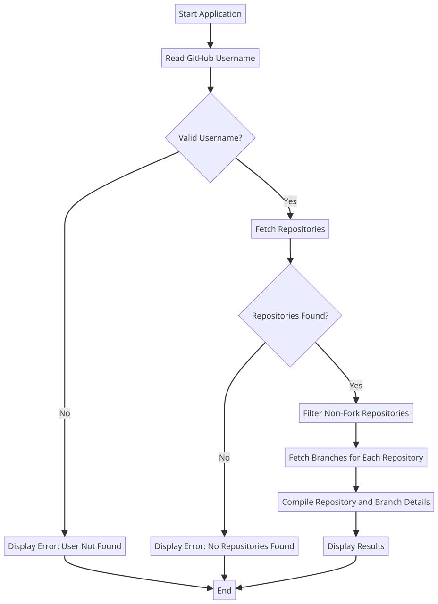

# GitHub Repository Search Service

## Description
The GitHub Repository Search Service is a web application that allows users to search for GitHub repositories by username and retrieve non-forked repositories and branch details. The service also caches data using Redis for improved performance and resilience.

## Features
- **Search Repositories**: Fetch and display non-fork repositories for a given GitHub username.
- **Branch Information**: Retrieve branch details for selected repositories.
- **Rate Limiting and Caching**: Implements rate limiting, caching with Redis, and fallbacks using Resilience4j.
- **Error Handling**: Custom error handling for 404 and other HTTP errors.

## Technologies

- **Java 17**
- **Spring Boot 3**
- **WebFlux**
- **Redis**
- **Resilience4j**
- **Mockito**
- **JUnit 5**

## Installation

1. **Clone the Repository**
   ```bash
   git clone https://github.com/your-username/github-search-repo.git

2. **Navigate to the Project Directory**
   ```bash
   cd github-search-repo
3. **Build the Project**
Ensure you have Maven installed, then run:
   ```bash
   mvn clean install
4. **Run the Application**
   ```bash
   mvn spring-boot:run

## Usage
 **API Endpoints:**

- **Search Repositories:** GET /api/github/users/{username}/repos
- **Get Branches:** GET /api/github/users/{username}/repos/{repoName}/branches
- **Check Rate Limit:** GET /api/github/rate-limit


  **Example:**

**To fetch non-forked repositories for a user:**

GET http://localhost:8080/api/github/users/testuser/repos

**Scheme:**


## Testing
**Example Unit Tests**

- **Controller Tests:** Ensure the controller endpoints return the correct responses.
- **Service Tests:** Test the core business logic for fetching repositories and branches.


1. **To run the tests, use the following command:**
```bash
mvn test
```

## Contributors
- GitHub - https://github.com/Hlib13
- E-mail: - hlib.chebotarov@gmail.com

## License
This project is licensed under the MIT License.


